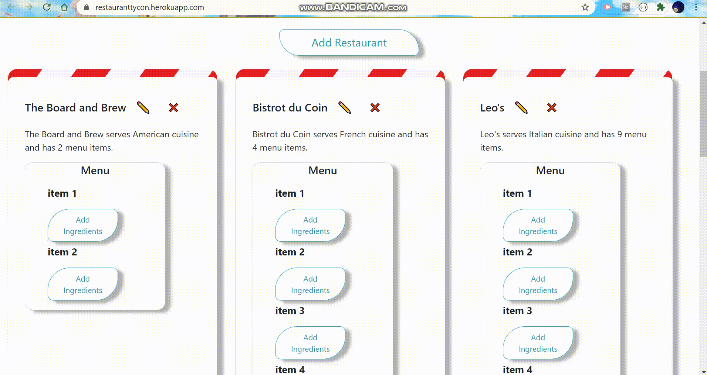
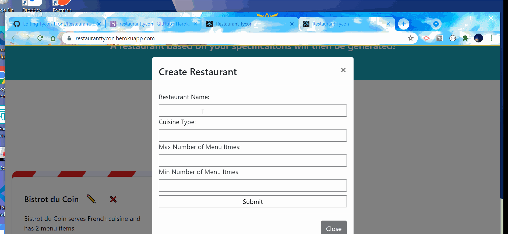

# Restaurant_Tycon
Build out your restaurant! Select your cuisine, menu, and ingredients.

Deployed: https://restauranttycon.herokuapp.com/

## Use

Welcome to Restaurant Tycon! To get started, click the add restaurant button! Simply sill out the form, and voila! You have yourself a restaurant! The form requires that you fill out each feild. The name feild accepts all characters and spaces. The cuisine feild accapts only letters and spaces. The max and min number fields only accept numbers between 1 and 15. Also, if the max field is less than the min field. Leave any fields empty, enter an invalid character, or set your min higher than your max and you will win a prize! The prize is an alert informing you of an error. No worries! Just edit the offending field and try submitting again!

Want to edit your restaurant?! Well, you can! Just click the pencil! Fill out the form, and bam! New restaurant! Oh, and by the way, the same rules you followed for creating a resturant, they apply here too!

Let's get fancy and ad some ingredients for each menu item, beacuse, why not? This time, you only have to worry about setting a max and min number.

Finally, if you don't want your restaurant anymore, just click the big red x and delete it.

That's all! Enjoy!

## Future Development

In the future I would like a user to be able to edit and delete menu items and ingredients.

## Notes

Repos for Herkou deployment can be found here.

Front End: https://github.com/scashmore/Tycon_Font

## Bug/Issue

There is an issue with socket.io. For some reason, depending on the order in which the client windows are opened, something like ths happens: 

This is also interfering with other sockets. The only one that will work is when an object is created.

Back End: https://github.com/scashmore/Tycon_Back